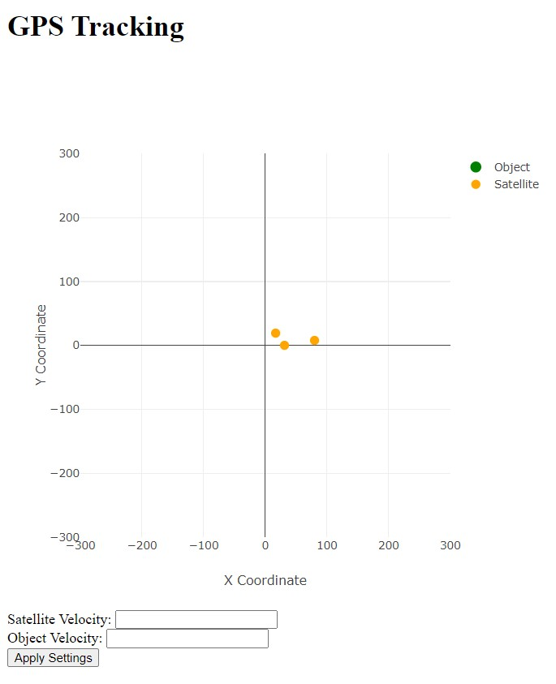

Емулятор вимірювальної частини GPS надається у вигляді Docker image під назвою iperekrestov/university/gps-emulation-service. Щоб запустити емулятор, виконайте наступні кроки:   
1. Завантажте Docker image з Docker Hub:  
docker pull iperekrestov/university:gps-emulation-service
2. Запустіть Docker контейнер, використовуючи наступну команду:  
docker run --name gps-emulator -p 4001:4000 iperekrestov/university:gps-emulation-service
 
Для зчитування даних з емулятора необхідно підключитися до нього через WebSocket:  
wscat -c ws://localhost:4001
  
Застосунок підключається до WebSocket сервера і зчитує дані про положення супутників і об'єкта, відображає дані та положення супутників і об'єкта на графіку за допомогою бібліотеки Plotly.
 
 
1. Підключення до WebSocket сервера:
 
Ця частина підключається до сервера через WebSocket і відкриває з'єднання. Після успішного підключення виводиться повідомлення в консоль.
2. Отримання даних від WebSocket:
 
Ця функція обробляє повідомлення від сервера. Вона отримує дані про супутники, розраховує затримку сигналу і відстань до об'єкта, а потім обчислює його положення (якщо є три супутники) та викликає функцію для оновлення графіку.
3. Обчислення положення об'єкта (trilateration):
 
Ця функція використовує координати супутників і відстані для обчислення координат об'єкта за допомогою методу трилатерації.
4. Відображення супутників і об'єкта на графіку:
 
Ця функція малює супутники і об'єкт на графіку за допомогою бібліотеки Plotly. Маркери для супутників і об'єкта відображаються різними кольорами, і графік оновлюється щоразу після отримання нових даних.
 
 
У застосунку можна змінювати параметри вимірювальної частини GPS.
1. Функція applySettings для оновлення параметрів:
 
Ця функція зчитує значення введених користувачем параметрів із полів форми (ID satVelocity та oobjVelocity). Потім вона відправляє ці дані на сервер через запит fetch до ендпоінта /config. Відправляються дані у форматі JSON з новими параметрами для швидкості супутника та об'єкта.
